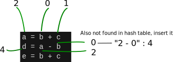
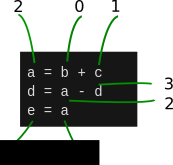

# 1. Introduction to Local Value Numbering (LVN)
Consider the following statements
```python
a = b + c
d = a - b
e = b + c
```
The expression `b + c` is redundant in the 3rd line of the assignment since `b + c` is already computed in the first assignment and no intervening operation redefines the arguments. The compiler should rewrite this block so `b + c` only have to compute once. 
```python
a = b + c
d = a - d
e = a
```
One of the techniques is **Local Value Numbering**. 

## 1.1 The algorithm

### 1.1.1 Assumption
The algorithm can only accept simple expression with a maximum of 3 variables and at most 1 operator (excluding `equal` operator), which is known as **Three-Address Code** [(TAC)](https://en.wikipedia.org/wiki/Three-address_code). E.g.,
```
a = b + c * d              # Not acceptable
e = f + g                  # Acceptable
h = i                      # Acceptable 
```

However, this does not make the algorithm **useless** because the complex expression can be broken down into several simpler TAC for ease of analysis. E.g.,
```python
# a = b + c * d becomes:
z = c * d                  # z is a temporal variable
a = b + z
```
Also compiler optimization often emits machine code, which matches the TAC form. E.g.,
```python
# a = b + c * d              ARM code 
z = c * d                  # MUL R0, R1, R2         ; Assuming R0 = z, R1 = c, R2 = d
a = b + z                  # ADD R3, R4, R0         ; Assuming R3 = a, R4 = b
```

### 1.1.2 Limitations
#### 1.1.2.1 Indirect substitution
Example below shows a problem. At the 3rd statement, `'f + c'` wont be substituted with `'b + c'` even though `f = b`. An additional algorithm need to be added on top of the original implementation to substitute any possible value on the operands to search for the occurence that happen before in order to substitute it. The details of the implementation is in section [1.1.5](https://github.com/usagitoneko97/python-ast/tree/master/A3.LVN#115-details-and-solution-for-indirect-substitution)
```python
# [Code 1]
# Input
a = b + c
f = b
e = f + c

# LVN output
a = b + c
f = b
e = f + c            # Fail to substitute

# Expected output
a = b + c
f = b
e = a
```

#### 1.1.2.2 Problems when redefining occurs
Consider the code below:
```python
# code                expected result
# -------------------------------------
a = x + y                       
b = x + y            # b = a   
a = 17               # Redefining `a` as 17                
c = x + y            # c = b since that c != a = 17
```

but LVN produces the following non-optimized result though correct:

```python
a = x + y
b = a
a = 17
c = x + y            # Fail to optimize this statement
```

To describe it briefly, what LVN will do is trying to replace the 4th statement from `c = x + y` to `c = a`, but it failed since a is then redefined in the third statement. Details and a workaround is provided in section [1.1.4](https://github.com/usagitoneko97/python-ast/tree/master/A3.LVN#114-details-and-solution-for-problems-when-redefining-occurs)

### 1.1.3 Algorithm in details

Consider the example in the introduction.
```python
a = b + c
d = a - b
e = b + c
``` 
The algorithm parses through the expression and enumerate each variable, and adds it to a Python `dictionary`. *Keep in mind that variable(s) at the left-hand side will always be assigned after the right-hand side has been assigned a new value number.* Variables already added will not be added again. The dictionary is used for searching purpose later. The following diagrams show how it's enumerated. 


Enumerated variables Table

| Key | Value |   
| :--:| :---: |   
| "b" |   0   |   
| "c" |   1   |   
| "a" |   2   |   
| "d" |   3   |   
| "e" |   4   |   

LVN then constructs the textual string on every expression on the right-hand side. E.g, **"0 + 1"** as a hash key to perform a lookup. It will fail since there is no previous insertion. LVN then creates an entry of **"0 + 1"** and assigns the value number correspond to `"a"`.


Right-hand side expressions Table

| Key     | Value |
| :--:    | :---: |
| "0 + 1" |   2   |

Because of textual string `"2 - 0"` is not found in the hashmap, it will also insert into the dictionary. 



Right-hand side expressions Table

| Key     | Value |
| :--:    | :---: |
| "0 + 1" |   2   |
| "2 - 0" |   4   |


On the third expression, 

Now because of string `"0 + 1"` is found in the hash, LVN will replace a variable that corresponds to the Value Number of the result of `"0 + 1"`, namely a that correspond with the Value Number 2. 




### 1.1.4 Details and solution for problems when redefining occurs.


Continuing on section [1.1.2.2](https://github.com/usagitoneko97/python-ast/tree/master/A3.LVN#1122-problems-when-redefining-occurs), technically, diagram above shows the 4th statement failed to substitute is due to the 3rd statement redefined `"a"`, thus modifies value number of `"a"` from **2** to **4** . On the 4th statement, it again discovers that `"x + y"` is redundant, but it cannot substitute with Value Number 2 since `"a"` does not carry Value Number **2** anymore. 

One way to solve this efficiently is by using `Static Single Assignment (SSA)`. 

In brief, SSA requires that each variable is assigned exactly once. For example, 

> x = 1   --->  x<sub>0</sub> = 1

> x = 2   --->  x<sub>1</sub> = 2

> y = 3   --->  y<sub>0</sub> = 3

After transforming the code in the beginning section to SSA form, 


After LVN, 
>  a<sub>0</sub> = x<sub>0</sub> + y<sub>0</sub> 

>  b<sub>0</sub> = a<sub>0</sub> 

>  a<sub>1</sub> = 17 

>  c<sub>1</sub> = a<sub>0</sub> 

With these new names defined, LVN can then produces the desired result. To be exact, `"x + y"` in the 4th assignment is now replaced by a<sub>0</sub>. An implementation will then map the a<sub>1</sub> to the original `a` and then declares a new temporary variable to hold a<sub>0</sub>

> a<sub>0</sub> = x + y                        
> b = a<sub>0</sub>             
> a = 17                
> c = a<sub>0</sub>   

### 1.1.5 Details and Solution for Indirect Substitution. 
Using the same example [above](https://github.com/usagitoneko97/python-ast/tree/master/A3.LVN#1121-indirect-substitution), 
```python
# [Code 1]
# Input
a = b + c
f = b
e = f + c

# Expected output
a = b + c
f = b
e = a
```
The algorithm that solves this problem is fairly simple. A table will be used 
to hold the information of simple assignment. Simple assignment means the right hand side is a single variable or a constant, but **not** an expression. 
```python
a = b       # a simple assignment
a = 3       # a simple assignment
a = a + 3   # not a simple assignment
a = b + c   # not a simple assignment
```

After getting pass the second statement in the example above, the table will be looking like:

**Simple Assignment Table**

| key  | value |
| :---:| :---: |
| 'f'  |  'b'  |

Upon executing the third statement, lvn will look up the expr `f + c` and it will failed since `f + c` does not occurs before. It will then look up at the table with the value of left operand. Because `f` exist in the table, it will substitute `f` with the value obtained from the table, namely `b`. Now it will do the look up with the expr `b + c` and it will return `a` since it's inserted before. The third statement will convert from `e = f + c` to `e = a`. 

Now consider example below:
```python
a = b + c
f = b
g = f
e = g + c  # Expected result : e = a
```

With the algorithm stated above, the table will be looking like:

**Simple Assignment Table**

| key  | value |
| :---:| :---: |
| 'f'  |  'b'  |
| 'g'  |  'f'  |

At the forth statement, `g` will be substitute with `f` and will perform a search with `f + c`. Since it does not return a result, the `f` will substitute with `b` and perform a search with `b + c` and this time it will return a result. 

One way to avoid using recursion as stated above is by letting `g = b` instead of `g = f`. With this every operands will only have to substitute at most once, instead of multiple time as stated above. 

**Simple Assignment Table**

| key  | value |
| :---:| :---: |
| 'f'  |  'b'  |
| 'g'  |  'b'  |

The example will then converted to:

Now consider example below:
```python
a = b + c
f = b
g = b
e = a
```

**Note**: In the real implementation however, the key and the value of the Simple Assignment Table is the Value Number of the variable, **not** the variable itself. 

## 1.2 The python implementation
There's 2 version that can be found on A3.LVN. [The first version](https://github.com/usagitoneko97/python-ast/tree/master/A3.LVN/Version1) is sort of legacy code and only used for reference. [The second version](https://github.com/usagitoneko97/python-ast/tree/master/A3.LVN/Version2) is more complete and includes additional algorithm stated above. 

---

In the real implementation, parsing AST 2 times like the explanation [above](https://github.com/usagitoneko97/python-ast/tree/master/A3.LVN#113-algorithm-in-details) is not required. Instead, the 2 steps (which is enumerating variables and substituting the expression on RHS) in [1.1.3](https://github.com/usagitoneko97/python-ast/tree/master/A3.LVN#113-algorithm-in-details) can happen concurrently without having to parse ast 2 times. 

### 1.2.1 Data structure used
For the sake of simplicity, **2 hash map** (dictionary in python) will be used, 1 for storing the corresponding value number to the variable, and 1 for storing the textual string like `"2 - 3"`. There's 2 data structures more to implement the ssa, one is **lvn_code_tuple_list**, a list of tuple, which is used to represent the source code in the form of Value Number. Another one is **lvn_code_tuples_list**, is a list of variables arranged in ascending order of their Value Number. It's used to find out what variable is associate with this Value Number. 

### 1.2.2 Dealing with an abstract syntax tree
Details on dealing with ast can be found [here](https://github.com/usagitoneko97/python-ast/tree/master/A2.ReversingAst)

But in brief, there is 3 ast node that is important for this assignment.

---

`Assign` is basically any assignment of variables. And is the parent node of the remaining 2 nodes. 

**Attr** :  
- `Targets` - is a list of node representing the left-hand side variable(s)
- `value` - is a single node on the right-hand side. For our example, it could be either *BinOp* or *Name*.  
Eg.
```python
a = b + c
b = 1
c = foo()
```
- `BinOp` is any binary operation.

    **Attr** :
    - `left` : left side of the operator
    - `op` : the operator. Eg. "+", "-", "*"
    - `right` : the right side of the operator
 Eg.
```python
b + c
c - d
d * s
```
- `Name` could be child of *Assign* or child of *BinOp*. `Name` is a string that represents a variable name.

    **Attr** :
    - `id` : the string of the variable name
    - `ctx` : the context of the variable. (store, load, del)
Eg. 
```python
b
c
d
```

### 1.2.3 Pseudocode
```python
def lvnOptimize(asTree)
    for assignNode in getAssignNodeClass(asTree):
    if assignNode.value is BinOp:
        # assign or locate the right hand side of assignment
        # the value number on the dict
        valNumLeft = addToValueDict(assignNode.value.left.id)
        valNumRight = addToValueDict(assignNode.value.right.id)
        # build something like "2Add3"
        queryString = valNumLeft + assignNode.value.op.__class__.__name__ +
                        valNumRight

        if queryString not in lvnDict:
            #add entry of querystring in LVN Dict with the value of lhs var name
        else:
            # It is in, replaces the binop with a single variable
            construct Name Node with id = variable corresponds to the value number
            # replaced the node
            assignNode.value = nameNode
    
    # Always assign the new value number on the lhs of assign class
    Add assignNode.targets[0].id to valueDict
    currentVal += 1
    return asTree
```

The full python source code can be found [here](lvn.py)

## 1.3 Extending LVN
**Note** : [lvn.py](lvn.py) will implement everything below here, but [lvn_optimize_without_extension](lvn_without_extension.py) will not include algorithm below. 

### 1.3.1 Commutative operations
Operation such as `x + y` and `y + x` may produce different key *eg. "0 + 1" or "1 + 0" even though they both meant the same thing. One way to solve this is to sort the operands by ordering their **Value Number**. 

### 1.3.2 Algebraic identities
LVN can apply identities to simplify the code. For example. `a * 1` and `a` should have the same value number. 

More example is shown below


### 1.3.3 Constant Propagation
Assume the following code, 
```python
a = 5
b = a          
c = b + 9    
d = b * c  
```

On the second statement, b will be assign to `5` instead of `a`, and it's already [before](https://github.com/usagitoneko97/python-ast/tree/master/A3.LVN#115-details-and-solution-for-indirect-substitution). Now the tricky part is the 3rd statement, where the `b` will be substituted with `5`, which rewrites the whole statement to 
```python
 c = 5 + 9
```
Since both of the operands is a constant, then it can be folded to `14`. 

On the last statement, similar to 3rd statement, `b` will be replace with `5`, and `c` will be replace with value of `14` that has been calculated in the 3rd statement. The whole statement will be rewrite as:
```python
d = 14 * 5
```
and since both of the operands is constant, it will now fold the expression. 

The result:
```python
a = 5
b = 5
c = 14
d = 70
```


## 1.4 Testing and running
### 1.4.1 Dependencies
[Astor](http://astor.readthedocs.io/en/latest/) is used to transform an ast to python readable source code. Install by,
```sh
pip install astor
```
### 1.4.2 Running the test
Run the unittest by
```bash
python -m unittest test_lvn.py
```
### 1.4.3 Using the lvn module
```python
import ast
from lvn import Lvn
import astor
import textwrap
# create a tree

ast_tree = ast.parse(textwrap.dedent("""\
    b = 2
    c = 3
    a = b + c
    d = b + c"""))
# initialize the test
lvn_test = Lvn()
optimized_tree = lvn_test.lvn_optimize(ast_tree)
# optional : transform ast to python code for viewing purpose
source = astor.to_source(optimized_tree)
print(source)
```
Resulting output stream: 
```python
>>> b = 2
>>> c = 3
>>> a = b + c
>>> d = a
```

## 1.5 References
- Torczon, L. and Cooper, M. ed., (2012). Ch8 - Introduction to optimization. In: Engineering a compiler, 2nd ed. Texas: Elsevier, Inc, pp.420-428.