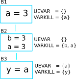
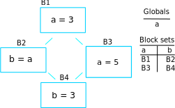

# 1. CFG
## 1.1. Table of Content

<!-- TOC -->

- [1. CFG](#1-cfg)
    - [1.1. Table of Content](#11-table-of-content)
    - [1.2. Basic blocks](#12-basic-blocks)
        - [1.2.1. Introduction to Control Flow Graph (CFG) and Basic Blocks](#121-introduction-to-control-flow-graph-cfg-and-basic-blocks)
        - [1.2.2. Transforming SSA to CFG](#122-transforming-ssa-to-cfg)
    - [1.3. Revisiting SSA](#13-revisiting-ssa)
    - [1.4. Minimal SSA](#14-minimal-ssa)
        - [1.4.1. Terminology](#141-terminology)
        - [1.4.2. Dominance](#142-dominance)
            - [1.4.2.1. Introduction](#1421-introduction)
            - [1.4.2.2. Algorithm](#1422-algorithm)
        - [1.4.3. Dominator Tree](#143-dominator-tree)
            - [1.4.3.1. Introduction](#1431-introduction)
            - [1.4.3.2. Algorithm](#1432-algorithm)
        - [1.4.4. Dominance Frontier](#144-dominance-frontier)
        - [1.4.5. Placing φ-Functions](#145-placing--functions)
    - [1.5. Creating a test](#15-creating-a-test)
        - [1.5.1. Generate test inputs](#151-generate-test-inputs)
        - [1.5.2. Asserting test output](#152-asserting-test-output)
    - [1.6. Live Variable Analysis](#16-live-variable-analysis)
        - [1.6.1. Uses for Live Variables](#161-uses-for-live-variables)
            - [1.6.1.1. Improve SSA construction](#1611-improve-ssa-construction)
            - [1.6.1.2. Finding uninitialized variables](#1612-finding-uninitialized-variables)
            - [1.6.1.3. Dead code elimination](#1613-dead-code-elimination)
        - [1.6.2. Terminology](#162-terminology)
        - [1.6.3. The basic concept of Live Variable Analysis](#163-the-basic-concept-of-live-variable-analysis)
            - [1.6.3.1. UEVAR and VARKILL](#1631-uevar-and-varkill)
            - [1.6.3.2. LIVEOUT](#1632-liveout)
        - [1.6.4. The algorithm for computing live variable](#164-the-algorithm-for-computing-live-variable)
        - [1.6.5. Testing for Live Variable Analysis](#165-testing-for-live-variable-analysis)
    - [1.7. Inserting φ-function](#17-inserting--function)
        - [1.7.1. Minimal SSA](#171-minimal-ssa)
        - [1.7.2. Semipruned SSA](#172-semipruned-ssa)
        - [1.7.3. Pruned SSA](#173-pruned-ssa)
        - [1.7.4. Worklist algorithm for inserting φ-function.](#174-worklist-algorithm-for-inserting--function)
            - [1.7.4.1. Basic concept](#1741-basic-concept)
            - [1.7.4.2. The algorithm](#1742-the-algorithm)
    - [1.8. References](#18-references)

<!-- /TOC -->
## 1.2. Basic blocks

### 1.2.1. Introduction to Control Flow Graph (CFG) and Basic Blocks
Basic block simply means a straight-line code sequence with no branches except the entry and the exit. 

E.g., 
```python
a = x + y                       
b = x + y            
a = 17               
c = x + y 
```

The code above can be group into a block, namely `Basic Block`. 

Now take a look at the code below. 

```python
a = x + y                       
if b < 3:
    x = 0
else:
    x = 1
b = x + y
```

The code above will generate multiple basic blocks since it has a branching statement. The basic blocks will then linked between themselves, and form a network of basic blocks, name **Control Flow Graph (CFG)**. 


### 1.2.2. Transforming SSA to CFG

Transforming SSA to CFG (multiple basic blocks) will required a recursive algorithm, since the program could be nested branch statement. For example, 

```python
x = a + b
if x < 2:
    if a < 2:
        a = 2
else:
    a = 3
```

The recursive function will require returning the head basic block and the tail basic block to the caller. The caller can then use the head and tail return to connects both of the blocks. I.e., in *If* statement, the caller will pass the body of If to the recursive function, and will connect itself with the head returned, and connects the tail to the next basic block. At the end of the operation, it will return the head and tail for the list of ast statement. 

## 1.3. Revisiting SSA
Static single assignment(SSA) had been discussed previously on [problems when redefining occurs](https://github.com/usagitoneko97/python-ast/tree/master/A3.LVN#114-details-and-solution-for-problems-when-redefining-occurs). SSA helped to solve that particular problem. To recall, to solve the problem, the code had transformed to SSA form.

```python
a = x + y                       
b = x + y            
a = 17               
c = x + y 
```

will transform to:
```python
a_0 = x_0 + y_0                       
b_0 = x_0 + y_0            
a_1 = 17               
c_0 = x_0 + y_0 
```

And will obtain:

```python
a_0 = x_0 + y_0                       
b_0 = a_0
a_1 = 17               
c_0 = a_0
```

Transforming the code above to SSA is primarily a simple matter of replacing the target of each assignment with a new variable and with a new version.

Now consider the code below:

```python
a = x + y                       
if b < 3:
    x = 0
else:
    x = 1
b = x + y
```


To transform a CFG, especially a branching of basic blocks, to SSA form is not as straightforward as above. The code below will demonstrate the problem. 

```python
a_0 = x_0 + y_0                       
if b_0 < 3:
    x_1 = 0
else:
    x_2 = 1
b_0 = x_? + y_0
```

At the last statement of the code, the use of `x` could be referring to either `x_1` or `x_2` depending on the execution to fall into one of the 2 blocks. To resolve this, a special statement is inserted before the last statement, called a **Φ (Phi) function**. This statement will generate a new definition of `x` called `x_3` by "choosing" either `x_1` or `x_2`. 

```python
a_0 = x_0 + y_0                       
if b_0 < 3:
    x_1 = 0
else:
    x_2 = 1
x_3 = Φ(x_1, x_2)
b_0 = x_3 + y_0
```


## 1.4. Minimal SSA 

There are many ways to insert Φ-function. The easiest way of inserting Φ-function is to insert it at every block that have joint points (multiple parents). But that could result in an excess amount of unnecessaries φ-function. Consider the CFG below: 


 Φ-function of `x` had to be inserted just before `B4` since it has been declared in both of the blocks `B2` and `B3`. But φ-function for variable `y` should not be inserted at `B4` since `B2` and `B3` had not declared variable `y`.


Minimal SSA basically means the SSA form that contains the minimum Φ-function. To complete the job of minimal SSA, they are a few of additional tree structures and algorithm that are required. The section here will explain all the algorithm that is required to compute a minimal SSA. 

### 1.4.1. Terminology

- **Dominate** - A node `u` is said to *dominate* a node w w.r.t
source vertex `s` if all the paths from `s` to `w` in the graph must pass through
node u.

- **Immediate Dominator** - A node `u` is said to be an *immediate dominator*
of a node `w` (denoted as `idom(w)`) if `u` dominates `w` and every other
dominator of `w` dominates `u`.

- **Strictly Dominates** - A node `d` is said to *strictly dominates* node `n` if `d` dominates `n` and `d` does not equal `n`

- **dominance frontier** - The *dominance frontier* of a node `d` is the set of all nodes `n` such that d dominates an immediate predecessor of `n`, but `d` does not strictly dominate `n`.

- **dominator tree** - A *dominator tree* is a tree where each node's children are those nodes it immediately dominates. Because the immediate dominator is unique, it is a tree. The start node is the root of the tree.


### 1.4.2. Dominance

#### 1.4.2.1. Introduction

As stated in terminology section above, a node `u` is said to *dominate* a node `w` w.r.t the source vertex `s` if all the paths from `s` to `w` in the graph must pass through node `u`. Take for example the graph below, Assume the source is `B1`:


To find the dominated nodes of `B1`, each node reachable from `B1` is visited. Let's start with `B2`. It is clear that there is only 1 path to reach `B2` and the path must pass through `B1`. So `B2` is one of the dominated nodes of `B1`. The same applies to `B3`. For `B4`, there are 2 paths and both have to pass through `B1` as well. So `B4` is also the dominated node of `B1`.   

To find the dominated nodes of `B2`, the same process is applied. Note however, `B1` is not reachable from `B2`, so it cannot be dominated by the latter. For `B4`, there are 2 paths, namely, `B1->B2->B4` and `B1->B3->B4`. The second path does not pass through `B2` and therefore `B2` does not **dominate** `B4`. As the result `B2` does not dominate any node.

`B3` is similar to `B2`. It does not dominate any node too.

`B4` does not have any outgoing link, so there is no node reachable from it, hence it does not dominate any node.

So, the dominator tree becomes:


#### 1.4.2.2. Algorithm

They are a few ways to calculate the dominance relationship between nodes. One of the easiest ways is, for each node `w`, remove the node from the graph and perform a [DFS](https://en.wikipedia.org/wiki/Depth-first_search) from source node and all the nodes that are not visited by DFS are the nodes that dominated by `w`. 

### 1.4.3. Dominator Tree

#### 1.4.3.1. Introduction
Given a node n in a flow graph, the set of nodes that strictly dominate `n` is given by `(Dom(n) − n)`. The node in that set that is closest to n is called n’s **Immediate Dominator(IDOM)**. To simplify the relationship of IDOM and DOM, a dominator tree is built. If `m` is `IDOM(n)`, then the dominator tree has an edge from `m` to `n`. The dominator tree for example in the section above is shown below: 


#### 1.4.3.2. Algorithm

The algorithm for constructing the dominance tree is fairly simple. Consider a slightly complex dominance relationship of a tree. Assume that the source is **B0**. 


And the dominance relationship between nodes is shown below:

**B0** : [**B1**, **B2**, **B3**]

**B1** : [**B2**, **B3**]

**B2** : []

**B3** : []

To build the tree, first go down to the bottom of the tree and start to build the dominator tree from bottom to the top. For every node `u` starting from the bottom, `u` will be added to the dominator tree, and will attach node that `u` dominates and doesn't have a parent. This will result in **B0** does not have **B2** and **B3** as it's child.

The dominator tree:

  

### 1.4.4. Dominance Frontier

In a simplified manner of explanation, the dominance frontier of a node `n` can be view as, from `n`'s point of view, going through his child, DF node is the first node that `n` doesn't *strictly dominates*. For example, consider following CFG. Assume that the source is **B0**. 


Assume that DF of `B5` needs to be found, it will iterate through both of the child, `B6` and `B8`. Since `B5` dominates both of them, they are not dominance frontier of `B5`. Then it will move on to `B7`, and `B5` still dominates `B7`. On block `B3` however, `B5` does not strictly dominates `B3` hence `B3` is the dominance frontier of `B5`. 

Pseudocode for calculating DF is provided below: 

```
for each node b
    if the number of immediate predecessors of b ≥ 2
        for each p in immediate predecessors of b
            runner := p.
            while runner ≠ idom(b)
                add b to runner’s dominance frontier set
                runner := idom(runner)
```

### 1.4.5. Placing φ-Functions
With dominance frontier, the φ-function can be now place strategically. But in order to further minimize the number of φ-function, liva variable analysis can be use to find out whether the φ-function for that particular variable is needed or not.

## 1.5. Creating a test
Section here will discuss on how to create a test fixture and ways to assert it. 

### 1.5.1. Generate test inputs

In this moments, there are 2 types of test input. The first type is an AST type. AST is the actual input of the CFG class and can be build like this:

```python
import ast
as_tree = ast.parse(ms("""\
            a = 3           # 1st
            if a > 3:       #  |
                a = E       # 2nd
            else:           # 3rd
                z = F       #  |
            y = F           # Eth
            """)
                            )
cfg_real = Cfg(as_tree)
```
AST can be used in testing the building of basic block, but when comes down to testing the dominator tree or the DF, it's very hard to construct a complex linkage of basic block. Therefore the test file provide also the method for building a complex basic block. 

```python
"""
                Note: '|' with no arrows means pointing down

                 A                   
               /   \                 
              B     C         
               \   /                 
                 D                   
"""
blocks = self.build_blocks_arb(block_links={'A': ['B', 'C'], 'B': ['D'], 'C': ['D'], 'D': []})
```

Note that by default, it will create the number of blocks depending on the number of entry of the *block_links* dictionary, and the default name of basic blocks will start from `A` and incremented by 1 ascii character. 

### 1.5.2. Asserting test output
The test file `test_dominator.py` had included several assert method. 

*To assert the dominance relationship*
```python
self.assertDominatorEqual(cfg_real, {'A': ['B', 'C', 'D'],
                                     'B': [],
                                     'C': [],
                                     'D': []})
```

*To assert 2 lists of basic blocks* :
```python
expected_blocks_list = self.build_blocks_arb(block_links={'A': ['B'], 'B': ['A']})

self.assertBasicBlockListEqual(real_blocks_list, expected_blocks)
```

*To assert the DF of the blocks* :
```python
self.assertDfEqual(cfg_real, {'A': [], 'B': ['B'], 'C': ['F'], 'D': ['E'],
                              'E': ['F'], 'F': ['B']})
```

## 1.6. Live Variable Analysis

 Live variable analysis will shows the lifespan of each variable across multiple blocks in a network of complex block chain, that is, the variables that may live out of the block, or variables that may be potentially read before their next write, or variable that may get killed in a basic blocks. 

### 1.6.1. Uses for Live Variables

#### 1.6.1.1. Improve SSA construction
To build minimal SSA, dominance frontier is used to find the strategic place to place phi functions. One problem with dominance frontier is that it suggests the nodes to which φ-function(s) should be placed based on structural information (CFG) without considering the data (variables), This leads to possibly inserting redundant φ-function. To stress my point, consider the following diagram: 

<!---
```
a_0 = b_0 + c_0
d_0 = 5
if a_0 < 3:
    d_0 = 4
// phi function for d here?
```
-->


In the code shown above, does a phi function needed at block **B3**? Even though the dominance frontier suggests that the definition of the variable d inside block 2 will result in φ-function being inserted in the last block, but because of variable d not being used there, the φ-function is not needed. This is where live variable analysis assists the dominance frontier to reduce the set of φ-functions.

#### 1.6.1.2. Finding uninitialized variables

 If a statement uses some variable v before it has been assigned a value, then clearly it is an error missed by the programmer. If the variable is defined in the same block, then it is a trivial task to determine if the variable has been initialized. However if the variable lives across multiple blocks, then it is no more trivial and we need LVA to make that deduction. 
 
#### 1.6.1.3. Dead code elimination

A store operation like `a = b + c` is not needed if a is not used anywhere throughout the code after the definition, or a **does not live out** of the block. 

### 1.6.2. Terminology

- **UEVAR** - those variables that are used in the current block before any redefinition in the current block.
- **VARKILL** - contains all the variables that are defined in current block
- **LIVEOUT** - contains all the variables that are live on exit from the block
- **BlockSets** - contains the information on where the variable is being defined. 
- **Globals** - sets of variable that are live across multiple blocks
- **Worklist(x)** - worklist of variable `x` contains all the block that defined `x`. 

### 1.6.3. The basic concept of Live Variable Analysis

#### 1.6.3.1. UEVAR and VARKILL
The concept of Uevar and Varkill is simple. Consider the following code.

```python
b = 3
a = b + c
```

| Uevar | varkill  |
| :---: | :------: |
| 'c'   | 'b', 'a' |

The Uevar and Varkill of the blocks above are very straightforward. The variable `c` is being referenced but there is no definition of that variable in the block, thus `c` is the **Uevar** of that particular block. But `b` is not even though it is being referenced since the definition of `b` exist in the block. The **Varkill** of that block is `b` and `a`. 

#### 1.6.3.2. LIVEOUT
**Liveout** set of a particular block will contain variables that will live on exit from that block. The formal definition of Liveout is shown below. 


Basically, the equation can be broken down to 2 parts, **Uevar(m)**, and **(Liveout(m) ∩ ~Varkill(m))**. To simplify the explanation, consider the following example. 


It is obvious that the variable `a` in **B2** is required from the parents of that block, specifically **B1** in this case, hence the `a` is included in  **Uevar**. Therefore **Liveout** of **B1** has to include `a` since it is live outside of the block. To simplify,  *Liveout of the current block has to include the union of all Uevar of the successor/child blocks.*, as described in the first part of the equation. 


To describe and explain the second part of the equation, consider following example. 


The variable `a` in block **B3** is required since `a` is in the set of **UEVAR**. The variable `a` is, however, not coming from the block **B2**, but from block **B1**. So the variable `a` has to be pass from block **B1** to **B3**. Hence *Liveout(B1) += Liveout(B2)*, and Liveout(B2) = 'a'. The algorithm for computing is called fixed-point iterative method and is discussed in the section below. 


But it's not always the liveout of the child block is the liveout of the current block. From the example below: 



The variable `a` from block **B3** will be refer to `a` in block **B2** but not **B1** since `a` is being redefined in block **B2**. With that being said, the final form of the equation for the second part will be:

*Liveout of the current block has to include the union of all Liveout of the successor/child blocks and not killed by the successor/child blocks.*

```
v ∈ LiveOut(m) ∩ ~VarKill(m).
```
 
### 1.6.4. The algorithm for computing live variable

The algorithm for computing UEVar and VarKILL is very straightforward. For every statement that can be represented in the form of x = y + z, the algorithm checks if the variable `y` and `z` do not exist in the VarKILL set, then add them in the UEVar set. Variable `x` will be added in VarKILL set. 

```
// assume block b has k operations
// of form ‘‘x ← y op z’’
for each block b
    Init(b)

Init(b)
UEVar(b) ← ∅
VarKill(b) ← ∅
for i ← 1 to k   //for every operation in this block
if y ∉ VarKill(b)
    then add y to UEVar(b)
if z ∉ VarKill(b)
    then add z to UEVar(b)
add x to VarKill(b)
```

For computing Liveout, however, needed an iterative fixed-point method. Using back the example previously, 


On the first iteration, all the liveout is initialized to empty. Liveout of block **B1** is empty since **B2** doesn't have any UEVar. It will need the second iteration to update the Liveout of **B2**, only then, the liveout of **B1** will update to include variable `a`. 

The algorithm is given below:
```
// assume CFG has N blocks
// numbered 0 to N - 1
for i ← 0 to N - 1
    LiveOut( i ) ← ∅
changed ← true
while (changed)
    changed ← false
    for i ← 0 to N - 1
        recompute LiveOut( i )
        if LiveOut( i ) changed then
            changed ← true
```

Where `recompute LIVEOUT` is simply solving the equation. 


Where `succ(n)` means **successors/child** of block `n`. 

### 1.6.5. Testing for Live Variable Analysis
**Note**: In file `test_live_variable.py`. 

 The first type is an AST type. AST is the actual input of the CFG class and can be built like this:

```python
import ast
as_tree = ast.parse(ms("""\
            a = 3           # 1st
            if a > 3:       #  |
                a = 3       # 2nd
            else:           # 3rd
                z = 4       #  |
            y = 4           # 4th
            """)
                            )
cfg_real = Cfg(as_tree)
```

the following method will build a more complex structure of basic blocks with code associate to them. After it has been built, the Cfg object needed to create and assign the parameters returned by `build_blocks_arb` to respective attributes. 

```python
"""
        Note: '|' with no arrows means pointing down

          A
        /   \
       B     C
        \   /
          D
"""
blocks, \
as_tree = th.build_blocks_arb(block_links={'A': ['B', 'C'], 'B': ['D'], 'C': ['D'], 'D': []},
                              code={'A': ms("""\
                                         temp = a + b
                                         """),
                                    'B': ms("""\
                                         temp_1 = 34
                                         """),
                                    'C': ms("""\
                                         if a < 3:
                                             pass
                                         """),
                                    'D': ms("""\
                                         temp = a + b
                                         """)
                                    })
as_tree = ast.parse(ast_string)
cfg_real = Cfg()
cfg_real.block_list = blocks
cfg_real.as_tree = as_tree
cfg_real.root = cfg_real.block_list[0]                                   
```

To gather the initial information (UEVAR, VARKILL), use:
```python
cfg_real.gather_initial_info()
```

And to assert it, the helper function in that test file can be used:
```python
expected_ue_var = ({'c'}, {'a', 'b'})
expected_var_kill = ({'a'}, {'y', 'x'})
self.assertUeVarKill(cfg_real.block_list, expected_ue_var, expected_var_kill)
```

To fill the liveout of all the blocks:
```python
cfg_real.compute_live_out()
```

To assert only the liveout, use:
```python
expected_live_out = {'A': {'s', 'i'}, 'B': {'s', 'i'}, 'C': {'s', 'i'},
                     'D': {'s', 'i'}, 'E': set()}

self.assertLiveOutEqual(cfg_real.block_list, expected_live_out)
```

## 1.7. Inserting φ-function

Insertion of φ-function is a very important phase during the transformation to SSA form. **Minimal SSA** will inserts φ-function at any joint points where two definitions of variables meet, but some of these φ-function may be dead, or in other words, not being used in subsequents blocks. 

To further minimize dead φ-function, information of variables(live variable analysis) may be used. There are 2 flavors of SSA that consider the liveness of variables, namely **pruned SSA** and **semipruned SSA**.  

Construction of **pruned ssa** will add a liveness test to the CFG to avoid adding dead φ-function. To perform liveness test, the algorithm must compute **LIVEOUT** sets,  which will result in the cost of building pruned SSA to be higher than **Minimal SSA**. 

**Semipruned SSA** is a compromise between **minimal SSA** and **pruned SSA**. By only considering *UEVAR* and *VARKILL*, this will eliminates some dead φ-function in minimal SSA, but could potentially generate dead φ-function as well. By avoiding the computation of **LIVEOUT**, the execution time will be faster compared to pruned SSA. 

### 1.7.1. Minimal SSA
To recall, Minimal SSA that had been discussed in [section 1.4](). Minimal SSA would not requires live variable analysis. By using only the fact of dominance frontiers, the algorithm can eliminate some useless φ-function based on only the structures of CFG. 

### 1.7.2. Semipruned SSA
The semipruned SSA will eliminates any names that are not live across a block boundary. To compute the semi-pruned SSA, the program can compute the **globals set** of variables, which in other words taking the union of all UEVAR of all blocks. φ-function will only need to be inserted for these global variables since if a variable was not included in Uevar of any blocks, that variable can be said that it was only declared but not used anywhere else. This means that φ-function for that variable was not necessary. 

In the process of computing the globals set, it also constructs, for each variable, a list of all blocks that contain a definition of that name, and it's called **Blocks Set**.  

Example: 


Globals
>    ['d', 'e', 'c', 'a', 'f']

Blocks set

| 'c'    | 'a'   | 'b'   | 'f'   | 'z'   | 'd'   |
| :----: | :---: | :---: | :---: | :---: | :---: |
| B1, B3 | B1    | B2    | B2    | B3    | B3    |

In very brief explanation of inserting φ-function in semi-pruned SSA form, the program will only insert the φ-function for the variables in the globals set. For each variable in globals set, it will then use the information in Blocks set to identify the location for inserting the φ-function. I.e., say variable `d` in globals needed a φ-function, it will then look at the blocks set, and identify that block **B3** has a definition of `d`, it will then insert φ-function in Dominance frontier of B3, DF(B3). 

### 1.7.3. Pruned SSA
To answer the question on why pruned SSA can further minimize the φ-function required from semi-pruned SSA, consider examples below. 



In semi-pruned SSA, because of the `a` is being referenced in B2, so `a` will be a member of globals. The definition of `a` in block **B3** will force a φ-function in block **B4**. But the φ-function in block **B4** may be redundant since `a` does not being referenced in that block, nor does not liveout of the block. So pruned SSA will combine the information of liveout of the blocks to determine the insertion of φ-function, which in this case, the φ-function for `a` will not get inserted. 

The actual algorithm for inserting φ-function in pruned SSA form is more or less the same as semi-pruned. The only additional step is, a verification is required just before the φ-function is inserted. Recall from above, just before the insertion of φ-function in dominance frontier of B3, a verification is needed to determine whether or not to insert the φ-function, and it is represented below:

Say variable `a` is the φ-function that needed to be inserted in block `B`, then 

`a` must be a member of Uevar(B) ∪ (Liveout(B) ∩ ~Varkill(B)), or

`a` must be a member of Liveout(any parent(B))

Which in other words, if `a` does not liveout from any of the parent blocks, `a` variable can be said useless in this current block. Thus, φ-function is not needed. 

### 1.7.4. Worklist algorithm for inserting φ-function. 

#### 1.7.4.1. Basic concept
Recall from above, to insert the φ-function, either pruned or semi-pruned SSA form, we need to gather 2 information, which is **Globals** and **BlockSet**. Apart from that, **WorkList** is introduced to represent all the block that defines the variable that is currently working on. To illustrate the importance of worklist, consider following example:


Definition of `a` in block **B3** will force a φ-function for `a` in block **B4**. The φ-function that inserted in block **B4** will in turn force a φ-function in block **B5**. Worklist is used to simplify the process of inserting φ-function. The **blocksets** and **worklist** for example above is shown below. 

Globals
>    ['a']

Blocks set

| 'a'   | 'b'    | 'f'   | 'g'   |
| :---: | :----: | :---: | :---: |
| B3    | B2, B4 | B5    | B1    |

The algorithm will initialize the worklist to blocks in blockset('a'), which contains **B3**. The definition in **B3** causes it to insert a φ-function at the start of each block in DF(B3) = B4. This insertion in B4 also places B4 in the worklist and B3 will be removed from the worklist. This process will continue for the rest of the blocks in the worklist. This is the basic concept of how the worklist is used to place the φ-function. 

In the case where DF(B1) is equal to B1, it will cause an infinite loop of inserting φ-function. So the algorithm will be responsible for:

- **Semipruned SSA** - stop the insertion of φ-function once the φ-function of that variable has already existed inside the block, or 
- **Pruned SSA** - each block has only 1 attempt of inserting the φ-function for a variable, whether the φ-function has inserted or not. (The condition in semi-pruned SSA cannot be used in pruned SSA since φ-function may not be inserted in pruned SSA, while in semi-pruned SSA, φ-function will definitely be inserted to the DF of all the block in the block list.)

The next section will provide the pseudocode for placement of φ-function based on the flavor of SSA. 

#### 1.7.4.2. The algorithm
The algorithm behaves quite similar between *pruned SSA* and *semi pruned SSA*. The differences are pruned required an additional check before placing φ-function, and the stopping condition may be different which are discussed above.


The algorithm for insertion of φ-function for semi-pruned SSA. 

```
for each name x ∈ Globals
    WorkList ← Blocks(x)
    for each block b ∈ WorkList
        for each block d in df(b)
            if d has no φ-function for x then
                insert a φ-function for x in d
                WorkList ← WorkList ∪ {d}
```

The algorithm for the additional check is:

```
Assume block and variable of the φ-function to be inserted is represented by blk, var

need_phi(blk, var):
    total_liveout ← {}
    for parent_blk in blk.parents:
        total_liveout ← total_liveout ∪ (liveout of parent_blk)

    if var ∈ total_liveout then
        return True
    else:
        return False

```

The algorithm for insertion of φ-function for pruned SSA. 

```
for each name x ∈ Globals
    WorkList ← Blocks(x)
    for each block b ∈ WorkList
        for each block d in df(b)
            if d has not been visited by x then
                if need_phi(b, x) then
                    insert a φ-function for x in d
                    WorkList ← WorkList ∪ {d}

```
**Note**: the φ-function inserted is just an indication to that block that the φ-function for that variable exist. The actual parameters is waiting to be filled in the next section, renaming of SSA. 

Once the φ-function is in place, it is time to renaming all the SSA to complete the formation of SSA. 


## 1.8. References
- Torczon, L. and Cooper, M. ed., (2012). Ch9 - Data-Flow Analysis. In: Engineering a compiler, 2nd ed. Texas: Elsevier, Inc, pp.495-519.
- Torczon, L. and Cooper, M. ed., (2012). Ch8 - Introduction to optimization. In: Engineering a compiler, 2nd ed. Texas: Elsevier, Inc, pp.445-457.
- Braun, M., Buchwald, S., Hack, S., Leißa, R., Mallon, C., & Zwinkau, A. (2013). Simple and efficient construction of static single assignment form. Lecture Notes in Computer Science (Including Subseries Lecture Notes in Artificial Intelligence and Lecture Notes in Bioinformatics), 7791 LNCS(March), 102–122. https://doi.org/10.1007/978-3-642-37051-9_6
- Cytron, R., Ferrante, J., Rosen, B. K., Wegman, M. N., & Zadeck, F. K. (1991). Efficiently computing static single assignment form and the control dependence graph. ACM Transactions on Programming Languages and Systems, 13(4), 451–490. https://doi.org/10.1145/115372.115320